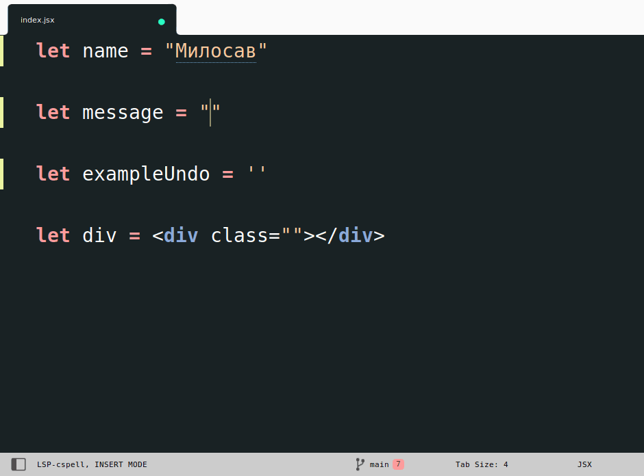

# Getting started



This plugin converts a string to template strings in following cases.
- When `${` is typed:
```jsx
// | - is the cursor
let x = 'Hello, ${|'
let x = `Hello, ${|}`

// in JSX
const p = <p class="Hello, ${|"></p>
const p = <p class={"Hello, ${}"}></p>
```

- When entering a new line in empty string like `""` or `''` :
```jsx
let x = '|'
let x = `
|
`

// it is valid syntax to have new lines in strings in JSX attributes
// so no conversion will take place
const p = <p class="|"></p>
const p = <p class="
|
"></p>

// When you add a `${`
// only then will the string be converted to a template string
const p = <p class="
	${|
"></p>
const p = <p class={`
	${|}
`}></p>
```

Press `undo`, to undo the conversion if you do not want template strings.
```jsx
let x = 'Hello, ${|'
let x = `Hello, ${|}` // press undo
let x = "Hello, ${|}"
```

> This plugin is inspired by [Template String Converter](https://marketplace.visualstudio.com/items?itemName=meganrogge.template-string-converter) by  Megan Rogge.
